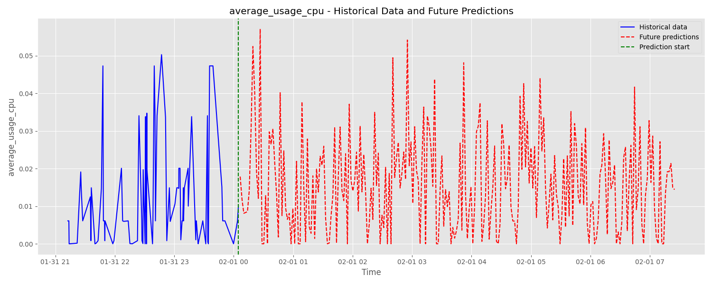
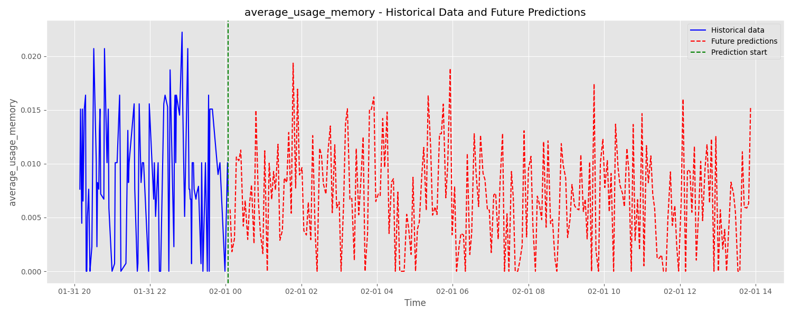

# Real-time Load Predictions System

A full-stack application for predicting and visualizing CPU and memory usage in real-time.

## Project Overview

This project integrates machine learning models with a web application to predict CPU and memory usage patterns based on historical data. It consists of three main components:

1. **ML Engine**: Python-based prediction models and data processing
2. **Backend**: Node.js/Express API with PostgreSQL database
3. **Frontend**: React-based dashboard with real-time visualizations

## ML Engine Predictions

### Model Performance Summary

#### CPU Usage Model Performance

| Model | RMSE | MAE | R² |
|-------|------|-----|-----|
| XGBoost | 0.001949 | 0.000538 | 0.982413 |
| Random Forest | 0.002020 | 0.000651 | 0.981096 |
| LSTM | 0.015657 | 0.010862 | -0.135534 |
| ARIMA | 0.019595 | 0.018319 | -0.778462 |

#### Memory Usage Model Performance

| Model | RMSE | MAE | R² |
|-------|------|-----|-----|
| XGBoost | 0.000861 | 0.000273 | 0.980629 |
| Random Forest | 0.000874 | 0.000275 | 0.980047 |
| LSTM | 0.006341 | 0.005278 | -0.050866 |
| ARIMA | 0.006558 | 0.005606 | -0.123842 |

### XGboost Model Prediction Results
The ML engine generates predictions for both CPU and memory usage using XGBoost models trained on historical data. 





## Architecture

```
┌─────────────────┐    ┌──────────────────┐    ┌─────────────────┐
│                 │    │                  │    │                 │
│  ML Engine      │◄───┤  Backend API     │◄───┤  Frontend       │
│ (Python/XGBoost)│    │ (Node.js/Express)│    │  (React)        │
│                 │───►│                  │───►│                 │
└─────────────────┘    └──────────────────┘    └─────────────────┘
        │                       │                       │
        │                       │                       │
        ▼                       ▼                       ▼
┌─────────────────┐    ┌──────────────────┐    ┌─────────────────┐
│                 │    │                  │    │                 │
│  Data Files     │    │  PostgreSQL      │    │  Client Browser │
│  (CSV)          │    │  Database        │    │                 │
│                 │    │                  │    │                 │
└─────────────────┘    └──────────────────┘    └─────────────────┘
```

## Features

- Import historical CPU and memory usage data from CSV files
- Train and run machine learning models to predict future resource usage
- Store historical data and predictions in a PostgreSQL database
- Visualize historical and predicted data in real-time
- Interactive dashboard with control panel for running predictions and imports

## Getting Started

### Prerequisites

- Node.js v14 or newer
- Python 3.8+ with scikit-learn, pandas, and other ML libraries
- PostgreSQL database
- pnpm package manager

### Installation

1. Clone the repository
```bash
git clone https://github.com/jambo0624/realtime-load-predictions.git
cd realtime-load-predictions
```

2. Set up the backend
```bash
cd backend
pnpm install
cp .env.example .env
# Edit the .env file with your database credentials
```

3. Set up the frontend
```bash
cd ../frontend
pnpm install
cp .env.example .env
# Edit the .env file with your server address
```

### Running the Application

1. Start the PostgreSQL database

2. Start the backend
```bash
cd backend
pnpm dev
```

3. Start the frontend (in a new terminal)
```bash
cd frontend
pnpm start
```

4. Access the application at http://localhost:3000

## Data Flow

1. CSV files with historical CPU/memory data are imported into the PostgreSQL database
2. The backend calls the ML engine's Python scripts to generate predictions
3. Prediction results are stored in the PostgreSQL database
4. The frontend fetches data from the backend via REST API
5. Real-time updates are pushed to the frontend via WebSocket connection

## Technologies Used

- **Backend**:
  - Node.js and Express
  - PostgreSQL database
  - Socket.io for WebSocket
  - Python-Shell for ML integration

- **Frontend**:
  - React.js
  - Chart.js for data visualization
  - Socket.io client for real-time updates
  - React Router for navigation

- **ML Engine**:
  - Python
  - XGBoost for predictions
  - pandas for data manipulation
  - scikit-learn for data preprocessing

## Directory Structure

```
realtime-load-predictions/
├── backend/              # Node.js/Express backend
├── frontend/             # React frontend
└── ml_engine/           # Python ML prediction scripts
    ├── data/            # Raw data files
    ├── models/          # Trained models
    ├── prediction/      # Prediction scripts
    ├── prediction_results/ # Generated predictions
    └── processed_data/  # Processed data files
```
